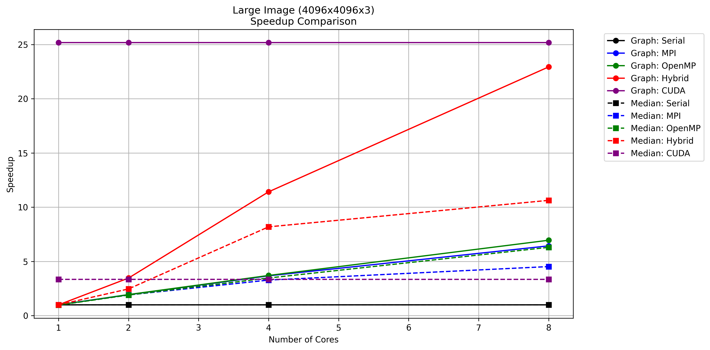

# Image Denoising using Parallel Computing Techniques

## 1. Introduction

Image noise, often introduced during acquisition or transmission, can significantly degrade image quality and hinder subsequent analysis. This project explores the application of parallel computing techniques to accelerate two common image denoising algorithms: the classical Median Filter and a graph-based Anisotropic Diffusion filter. The goal is to compare the performance of serial implementations against parallel versions using MPI, OpenMP, a hybrid MPI+OpenMP approach, and CUDA across different image sizes and processing core/thread counts.

## 2. Methods

Two distinct denoising algorithms were implemented and parallelized:

### 2.1 Median Filter

The Median Filter is a non-linear digital filtering technique often used to remove salt-and-pepper noise. It operates by replacing the value of each pixel with the median value of the intensity levels in a neighborhood surrounding that pixel.

- **Implementation**: A 3x3 neighborhood window is considered for each pixel (and each color channel in an RGB image). The intensity values within this window are collected, sorted, and the median value (the 5th element in a sorted 9-element window) replaces the original pixel's value. Border pixels are typically handled by padding or are left unprocessed.
- **Parallelization**: The operation for each pixel is independent of others (based on the *original* image data), making it highly parallelizable.
    - **OpenMP**: A `#pragma omp parallel for` directive is used to distribute the outer loops (over image rows/columns) among available threads.
    - **MPI**: The image is typically divided into horizontal strips, with each MPI process handling the filtering for its assigned rows. Boundary rows might require communication (halo exchange) if the filter needed data from neighboring strips, but the current implementation processes rows independently based on the original input, simplifying this. Results are gathered by the root process.
    - **Hybrid (MPI+OpenMP)**: Combines MPI's domain decomposition (row strips) with OpenMP's shared-memory parallelism within each MPI process to filter its assigned strip faster.
    - **CUDA**: A kernel is launched where each thread is responsible for calculating the median value for one output pixel (or a small block of pixels). Threads read the 3x3 neighborhood from global memory, perform the sort locally (e.g., using registers or shared memory), and write the result back.

### 2.2 Graph-based Anisotropic Diffusion (Simplified Graph Laplacian)

This method aims to reduce noise while preserving significant image features like edges. It iteratively updates pixel values based on their neighbors, but the influence of neighbors is weighted based on intensity differences. This prevents smoothing across sharp edges.

- **Implementation**: The implemented filter iteratively updates each pixel based on its 4-connected neighbors (up, down, left, right). For each neighbor, a weight is calculated using `expf(-(diff * diff) / (2 * sigma * sigma))`, where `diff` is the intensity difference between the neighbor and the center pixel. A weighted average (`smooth_value`) of the neighbors is computed. If the absolute difference between `smooth_value` and the center pixel exceeds a `threshold`, the pixel is replaced by `smooth_value`; otherwise, it's updated partially using `center + alpha * (smooth_value - center)`. This process repeats for a fixed number of `iterations`.
- **Parallelization**: Similar to the median filter, the update for each pixel in an iteration depends on the *previous* iteration's values.
    - **OpenMP**: Parallelizes the loops over pixels within each iteration using `#pragma omp parallel for`. A temporary buffer swap is needed between iterations, managed carefully (e.g., using `#pragma omp single`).
    - **MPI**: The image is decomposed into strips. Each process computes the updates for its strip. Halo exchange is crucial here, as calculating updates for pixels near the boundary of a strip requires neighbor values from adjacent strips (handled by `MPI_Allgatherv` in the provided code, which effectively synchronizes the entire image state after each iteration's computation).
    - **Hybrid (MPI+OpenMP)**: MPI handles the domain decomposition and halo exchange between iterations, while OpenMP parallelizes the pixel update calculations within each process's assigned strip.
    - **CUDA**: A kernel updates pixels in parallel. Each thread calculates the weighted average for its assigned pixel based on neighbors read from global memory (representing the previous iteration). A temporary buffer (or ping-ponging between two device buffers) is used to store results for the next iteration. Synchronization (`cudaDeviceSynchronize` implicitly via kernel launch or explicit sync) is needed between iterations.

### 2.3 Relation to Graph Laplacian

The concept of a Graph Laplacian is fundamental in graph signal processing. For a graph with nodes (pixels) and edges (connecting adjacent pixels), the Laplacian operator measures the difference between a node's value and the average value of its neighbors. It's often defined as `L = D - A`, where `D` is the degree matrix and `A` is the adjacency matrix. Weighted graphs use edge weights in `A` and `D`.

The implemented graph-based diffusion filter treats the image as a graph where pixels are nodes connected to their neighbors, with edge weights determined by Gaussian-weighted intensity differences (stronger weights for similar pixels, weaker for dissimilar ones). This creates an anisotropic smoothing process where each pixel iteratively moves toward a weighted average of its neighbors, resembling a discrete diffusion process governed by the graph Laplacian (∂u/∂t = -L u). The weights ensure smoothing occurs primarily within homogeneous regions rather than across edges, while the alpha parameter controls the diffusion rate. By combining these principles—graph-based neighbor weighting, iterative Laplacian-like updates, and edge-aware conductivity—the filter effectively approximates heat diffusion on a pixel similarity graph, providing edge-preserving noise reduction akin to spectral graph filtering.

The graph laplacian is more complicated to implement and requires more resources, unless external packages used. That is why we used the simplified version.

## 3. Folder structure and how to run:

```sh
.
├─cuda
├─hybrid
├─mpi
├─openmp
├─plots
└─serial
```

Each one of the folders has 5 required files to run, +3 optional files, which are the output images. For example:

```sh
[method_name]
├── add_noise.c             # Add noise to an input image.
├── graph_denoise_rgb.c     # Apply graph filter.
├── median_denoise_rgb.c    # Apply median (classical) filter.
├── Lenna.png               # Input image of size 512*512*3 without noise.
# ├── noisy_output.png 
# ├── graph_denoised_output.png
# ├── median_denoised_output.png
└── run_denoise.sh          # Run experiments
```

The `plots` folder shows the time, speedup, and efficiency comparison diagrams.

**To run the experiments**:

```sh
bash run_denoise.sh <input> <noising_rate> <alpha> <iterations> <resize> <np>
```
- `<input>` is the image (e.g., in .png format) without noise.
- `<noising_rate>` is how much salt and pepper noise tp add to the image. 
- `<alpha>` input parameter for the graph method, to control the diffusion rate (higher the value, higher the diffusion).
- `<iterations>` input parameter for the graph method, number of iterations to apply alpha.
- `<resize>` yes or no input parameter, whether to resize to 4096 image or not (yes means resize).
- `<np>` number of processes or threads to be used (ignored in case of serial and CUDA).

Example:
```sh
$ bash run_denoise.sh Lenna.png 0.01 0.01 5 no 4
```


## 4. Results

> All the reported results ran on the mcs1 server. Averaged over **10 runs**.

For image of size `4096*4096*3` with `4` processes:

- **Serial**:
    - Graph average over 10 runs: **20.9180**
    - Median average over 10 runs: **2.6460**

- **MPI**:
    - Graph average over 10 runs: **5.6999**
    - Median average over 10 runs: **0.8070**

- **OpenMP**:
    - Graph average over 10 runs: **5.6489**
    - Median average over 10 runs: **0.7625**

- **Hybrid**:
    - Graph average over 10 runs: **1.8322** (6.0368)
    - Median average over 10 runs: **0.3232** (1.0744)

- **CUDA**:
    - Graph average over 10 runs: **0.8310**
    - Median average over 10 runs: **0.7900**

> Hybrid uses 4 MPI processes and 4 threads for each of them (total 16), numbers in brackets 2 processes * 2 threads (total 4). 

### **Detailed experiments**:

#### **Graph (Small Image `512x512x3`)**
##### Execution Time (seconds)
|          | 1       | 2       | 4       | 8       |
|----------|---------|---------|---------|---------|
| Serial   | 0.4200  | -       | -       | -       |
| MPI      | 0.4310  | 0.2260  | 0.1191  | 0.0675  |
| OpenMP   | 0.4315  | 0.2190  | 0.1153  | 0.0607  |
| Hybrid   | 0.4313  | 0.1175  | 0.0389  | 0.0344  |
| CUDA     | 0.6150  | -       | -       | -       |

##### Speedup (vs. Serial)
|          | 1       | 2       | 4       | 8       |
|----------|---------|---------|---------|---------|
| MPI      | 0.97    | 1.86    | 3.53    | 6.22    |
| OpenMP   | 0.97    | 1.92    | 3.64    | 6.92    |
| Hybrid   | 0.97    | 3.57    | 10.80   | 12.21   |
| CUDA     | 0.68    | -       | -       | -       |

##### Efficiency (Speedup / Cores)
|          | 1    | 2    | 4    | 8    |
|----------|------|------|------|------|
| MPI      | 0.97 | 0.93 | 0.88 | 0.78 |
| OpenMP   | 0.97 | 0.96 | 0.91 | 0.86 |
| Hybrid | 0.97 | 0.90 | 0.68 | 0.19 |


#### **Graph (Large Image `4096x4096x3`)**
##### Execution Time (seconds)
|          | 1       | 2       | 4       | 8       |
|----------|---------|---------|---------|---------|
| Serial   | 20.918  | -       | -       | -       |
| MPI      | 20.9844 | 10.8702 | 5.6999  | 3.2509  |
| OpenMP   | 21.0433 | 10.7579 | 5.6489  | 3.0085  |
| Hybrid   | 21.0257 | 6.0368  | 1.8322  | 0.912   |
| CUDA     | 0.831   | -       | -       | -       |

##### Speedup (vs. Serial)
|          | 1       | 2       | 4       | 8       |
|----------|---------|---------|---------|---------|
| MPI      | 1.00    | 1.92    | 3.67    | 6.43    |
| OpenMP   | 0.99    | 1.94    | 3.70    | 6.96    |
| Hybrid   | 0.99    | 3.47    | 11.42   | 22.93   |
| CUDA     | 25.17   | -       | -       | -       |

##### Efficiency (Speedup / Cores)
|          | 1    | 2    | 4    | 8    |
|----------|------|------|------|------|
| MPI      | 1.00 | 0.96 | 0.92 | 0.80 |
| OpenMP   | 0.99 | 0.97 | 0.93 | 0.87 |
| Hybrid | 0.99 | 0.87 | 0.72 | 0.36 |


#### **Median (Small Image `512x512x3`)**
##### Execution Time (seconds)
|          | 1       | 2       | 4       | 8       |
|----------|---------|---------|---------|---------|
| Serial   | 0.0800  | -       | -       | -       |
| MPI      | 0.0829  | 0.0446  | 0.0315  | 0.0188  |
| OpenMP   | 0.0856  | 0.0445  | 0.0241  | 0.0131  |
| Hybrid   | 2.0842  | 1.0322  | 0.0114  | 0.0152  |
| CUDA     | 0.6010  | -       | -       | -       |

##### Speedup (vs. Serial)
|          | 1       | 2       | 4       | 8       |
|----------|---------|---------|---------|---------|
| MPI      | 0.97    | 1.79    | 2.54    | 4.26    |
| OpenMP   | 0.93    | 1.80    | 3.32    | 6.11    |
| Hybrid   | 0.04    | 0.08    | 7.02    | 5.26    |
| CUDA     | 0.13    | -       | -       | -       |

##### Efficiency (Speedup / Cores)
|          | 1    | 2    | 4    | 8    |
|----------|------|------|------|------|
| MPI      | 0.97 | 0.90 | 0.64 | 0.53 |
| OpenMP   | 0.93 | 0.90 | 0.83 | 0.76 |
| Hybrid | 0.04 | 0.02 | 0.44 | 0.08 |


#### **Median (Large Image `4096x4096x3`)**
##### Execution Time (seconds)
|          | 1       | 2       | 4       | 8       |
|----------|---------|---------|---------|---------|
| Serial   | 2.646   | -       | -       | -       |
| MPI      | 2.6403  | 1.3877  | 0.807   | 0.5849  |
| OpenMP   | 2.7186  | 1.3922  | 0.7625  | 0.4201  |
| Hybrid   | 2.6554  | 1.0744  | 0.3232  | 0.2489  |
| CUDA     | 0.79    | -       | -       | -       |

##### Speedup (vs. Serial)
|          | 1       | 2       | 4       | 8       |
|----------|---------|---------|---------|---------|
| MPI      | 1.00    | 1.91    | 3.28    | 4.52    |
| OpenMP   | 0.97    | 1.90    | 3.47    | 6.30    |
| Hybrid   | 1.00    | 2.46    | 8.19    | 10.63   |
| CUDA     | 3.35    | -       | -       | -       |

##### Efficiency (Speedup / Cores)
|          | 1    | 2    | 4    | 8    |
|----------|------|------|------|------|
| MPI      | 1.00 | 0.95 | 0.82 | 0.57 |
| OpenMP   | 0.97 | 0.95 | 0.87 | 0.79 |
| Hybrid | 1.00 | 0.62 | 0.51 | 0.17 |



> More plots are in the attached `plots` folder.

## 5. Results Analysis

1.  **Algorithm Complexity**: The Graph-based filter is significantly more computationally intensive than the Median filter, as reflected in the much longer serial execution times (e.g., ~21s vs ~2.6s for the large image).
2.  **Parallel Speedup**: All parallel methods (MPI, OpenMP, Hybrid, CUDA) show substantial speedups over the serial implementation, especially for the larger image size.
3.  **Scalability**:
    *   **MPI & OpenMP**: Both show good scalability as the number of processes/threads increases from 1 to 8. OpenMP appears slightly faster than MPI in most cases for the same core count, likely due to lower communication overhead compared to MPI's message passing (especially the `MPI_Allgatherv` in the graph filter).
    *   **Hybrid**: The hybrid approach consistently outperforms pure MPI or OpenMP for the same *total* number of cores (e.g., 4 MPI processes * 4 OpenMP threads = 16 cores total, compared to 8 MPI processes or 8 OpenMP threads). This suggests that combining distributed memory parallelism (MPI) with shared memory parallelism (OpenMP) effectively utilizes resources, especially when the number of cores grows. The speedup from 2x2 to 4x4 cores is significant.
    *   **CUDA**: CUDA provides the most dramatic speedup for the graph-based filter on the large image (0.83s vs 20.9s serial), leveraging the massive parallelism of the GPU. For the median filter, CUDA is also fast but comparable to the 8-core Hybrid/OpenMP versions, possibly indicating that the median filter's complexity doesn't fully saturate the GPU or that memory bandwidth becomes a limiting factor.
4.  **Image Size**: Speedups are more pronounced for the larger `4096x4096` image, where the computation outweighs the overhead of parallelization (communication, thread management). For the smaller `512x512` image, overheads can sometimes negate the benefits, especially for MPI/Hybrid at low core counts, and CUDA's fixed overheads (memory transfers, kernel launch) make its advantage less dominant compared to the large image case.
5.  **Median Filter Anomaly (Hybrid)**: The Hybrid result for the small image median filter (2.08s for 1x1) seems anomalously high compared to serial/MPI/OpenMP (~0.08s). This might indicate an issue with the timing or setup for that specific small-scale hybrid run, possibly excessive overhead. The 4x4 result (0.0114s) looks reasonable.

## 6. Final Comments and Next steps
- Initially the experiment ran locally and the runtime for the serial graph method was very comparable to the median method (2.4 vs 2.3 seconds), but this was not the case on the server. Maybe the local CPU utilizes the use of auto vectorization.
- This simplified approach is not perfect when it comes to removing all noises, but it preserve the details of the image, as shown bellow in image 2.


<center><i>Image 1: This is how the pipeline works, from left to right, original, noise, median, and graph.</i></center>
<br>

Zooming in the 2 outputs of median and graph:

<center><i>Image 2: left is Median, right is Graph</i></center> 
<br>
In the median we can see that the hat is blured and we no longer can see the stripes, while the graph method keeps the lines but there are some salt and pepper noise that was not removed.

**Next Steps:**, 
- Try out different block sizes for CUDA.
- Enhance the simplified graph method. 
- Explore the **Full Graph Laplacian**. 